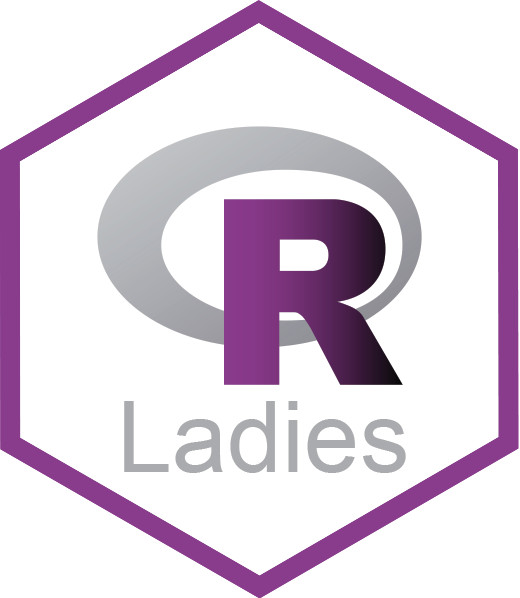
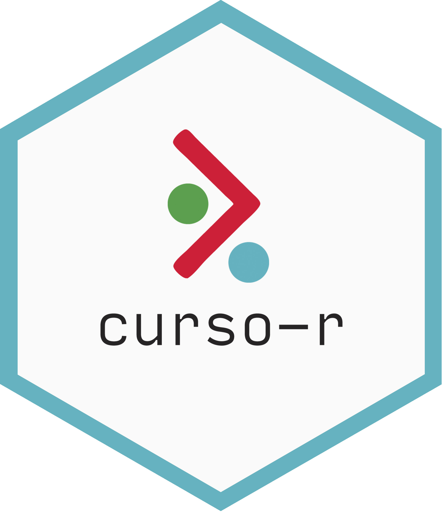
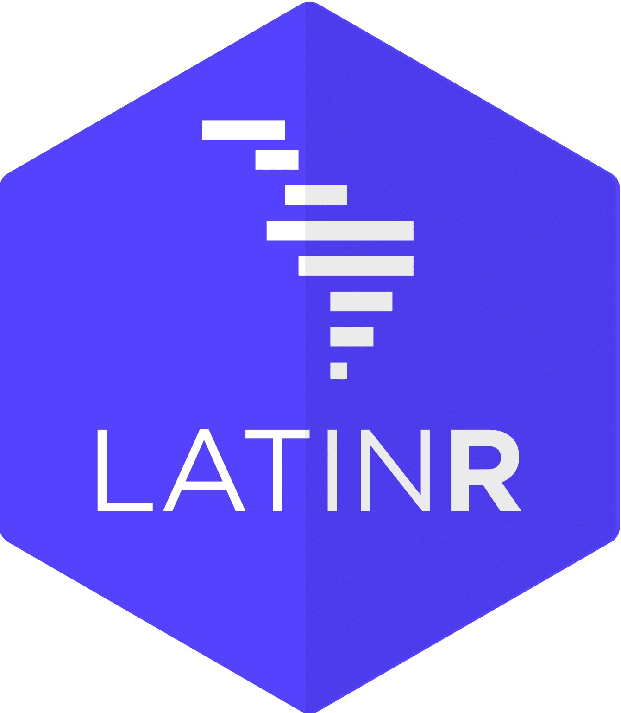

class: middle

```{r setup, include=FALSE}
options(htmltools.dir.version = FALSE)
knitr::opts_chunk$set(
  fig.width = 9,
  fig.height = 3.5,
  fig.retina = 3,
  out.width = "100%",
  cache = FALSE,
  echo = FALSE,
  message = FALSE,
  warning = FALSE,
  hiline = TRUE,
  fig.align = "center"
)
```

```{r eval=FALSE, include=FALSE}
# devtools::install_github("hadley/emo")
# devtools::install_github("gadenbuie/xaringanExtra")
# devtools::install_github("gadenbuie/ermoji")
```

```{css}
/* custom.css */
.left-code {
  color: #777;
  width: 38%;
  height: 92%;
  float: left;
}
.right-plot {
  width: 60%;
  float: right;
  padding-left: 1%;
}
```


```{r xaringanExtra-clipboard, echo=FALSE}
xaringanExtra::use_clipboard()
```


```{r xaringan-themer, include=FALSE, warning=FALSE}
library(xaringanthemer)
style_duo_accent(
  primary_color = "#826b37",
  title_slide_background_color = "#e6ddc8",
  title_slide_text_color = "#5a513b",
  inverse_text_color = "#826b37",
  inverse_header_color = "#826b37",
  inverse_background_color = "#d1c29e",
  secondary_color = "#EDBBC8",
  
  header_font_google = google_font("Josefin Slab", "600"),
  text_font_google   = google_font("Work Sans", "300", "300i"),
  code_font_google   = google_font("Fira Code"),
  base_font_size = "25px"
)
```


```{r xaringan-logo, echo=FALSE}
xaringanExtra::use_logo(
  image_url = "img/logo-python.png", 
    link_url = "https://2021.pythonbrasil.org.br/"
)
```


---


### R: Comunidades, eventos, pacotes, livros..
<center>

<a href='https://education.rstudio.com/trainers/'>  </a>


<a href='https://rladies.org/'>  </a>

<a href='https://curso-r.com/'>  </a>

<a href='https://livro.curso-r.com/'>  </a>


<a href='https://saopaulo2019.satrdays.org/'>  </a>
<a href='https://latin-r.com/'>  </a>
<a href='https://carpentries.org/'>   </a>
<a href='https://user2021.r-project.org/'>   </a>

<a href='https://cienciadedatos.github.io/dados/'>  </a>
<a href='https://beatrizmilz.github.io/mananciais/'>  </a>
</center>


---
class: inverse, middle, center

# slide de transição


---
class: center

## Muito obrigada!

.pull-left[

```{r echo=FALSE, fig.align='center', out.width="50%"}
knitr::include_graphics("https://media.giphy.com/media/M9NbzZjAcxq9jS9LZJ/giphy.gif")
```


Slides criados usando os pacotes em R  📦 :

[**xaringan**](https://github.com/yihui/xaringan)<br>
[gadenbuie/xaringanthemer](https://github.com/gadenbuie/xaringanthemer)

O chakra vem da biblioteca javascript [remark.js](https://remarkjs.com), e os pacotes  [**knitr**](http://yihui.name/knitr), e [R Markdown](https://rmarkdown.rstudio.com).
]

.pull-right[

<center>
</center>

<i class="fas fa-home"></i> [beatrizmilz.com](https://beatrizmilz.com)

<i class="fab fa-twitter"></i> [@BeaMilz](https://twitter.com/BeaMilz)

<!-- <i class="far fa-envelope"></i> [milz.bea@gmail.com](mailto:milz.bea@gmail.com) -->
]


<!-- inicio academic icons -->
<link rel="stylesheet" href="https://cdn.jsdelivr.net/gh/jpswalsh/academicons@1/css/academicons.min.css">
<!-- final academic icons -->

 
<!-- inicio font awesome -->
<script src="https://kit.fontawesome.com/1f72d6921a.js" crossorigin="anonymous"></script>

<!-- final font awesome -->
