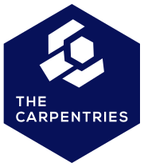

class: middle

```{r setup, include=FALSE}
options(htmltools.dir.version = FALSE)
knitr::opts_chunk$set(
  fig.width = 9,
  fig.height = 3.5,
  fig.retina = 3,
  out.width = "100%",
  cache = FALSE,
  echo = FALSE,
  message = FALSE,
  warning = FALSE,
  hiline = TRUE,
  fig.align = "center"
)
```

```{r eval=FALSE, include=FALSE}
# devtools::install_github("hadley/emo")
# devtools::install_github("gadenbuie/xaringanExtra")
# devtools::install_github("gadenbuie/ermoji")
```

```{css}
/* custom.css */
.left-code {
  color: #777;
  width: 38%;
  height: 92%;
  float: left;
}
.right-plot {
  width: 60%;
  float: right;
  padding-left: 1%;
}

a, a > code {
    text-decoration: underline;
}
```


```{r xaringanExtra-clipboard, echo=FALSE}
xaringanExtra::use_clipboard()
```


```{r xaringan-themer, include=FALSE, warning=FALSE}
library(xaringanthemer)
style_duo_accent(
  primary_color = "#826b37",
  title_slide_background_color = "#e6ddc8",
  title_slide_text_color = "#5a513b",
  inverse_text_color = "#826b37",
  inverse_header_color = "#826b37",
  inverse_background_color = "#d1c29e",
  secondary_color = "#EDBBC8",
  
  header_font_google = google_font("Josefin Slab", "600"),
  text_font_google   = google_font("Work Sans", "300", "300i"),
  code_font_google   = google_font("Fira Code"),
  base_font_size = "25px"
)
```


```{r xaringan-logo, echo=FALSE}
xaringanExtra::use_logo(
  image_url = "img/logo-python.png", 
    link_url = "https://2021.pythonbrasil.org.br/"
)
```


.pull-left[

## Beatriz Milz

- 2019 - * - Doutoranda em Ciência Ambiental - PROCAM/IEE/USP

- 2016-2018 - Mestrado em Ciências - Programa de Pós-Graduação em Análise Ambiental Integrada - UNIFESP

- 2012-2015 - Bacharelado em Gestão Ambiental - EACH/USP 
]

.pull-right[
<br>
<center>
</center>

]

???

Essa palestra tem como objetivo apresentar um conteúdo introdutório e será mostrada na IDE RStudio, usando arquivos RMarkdown. Primeiramente farei uma abertura e falarei um pouco sobre mim e qual a minha atuação na comunidade (máx 5 min); depois a ideia é falar um pouco do contexto que surgiu a ideia da palestra, uma história de como decidi usar o RStudio para aprender programar em Python (máx 10 min);  farei então uma introdução ao pacote reticulate, e apresentar algumas funções importantes, como: criar ambientes virtuais, instalar pacotes, checar se algum pacote está instalado, etc (10 min). Depois falarei sobre um pacote maravilhoso que funciona bem com reticulate e Python para criar vários produtos que podem ser disponibilizados na internet: o R Markdown (10 min). O  tempo restante será para perguntas e interação com as pessoas participantes. Não usarei live-coding, pretendo criar slides com o pacote xaringan (em R) e adicionar os códigos e print screens da IDE nos slides.


---


### R: Comunidades, eventos, pacotes, livros..
<center>

<a href='https://education.rstudio.com/trainers/'>  </a>


<a href='https://rladies.org/'>  </a>

<a href='https://curso-r.com/'>  </a>

<a href='https://livro.curso-r.com/'>  </a>


<a href='https://saopaulo2019.satrdays.org/'>  </a>
<a href='https://latin-r.com/'>  </a>
<a href='https://carpentries.org/'>  </a>
<a href='https://user2021.r-project.org/'>  </a>

<a href='https://cienciadedatos.github.io/dados/'>  </a>
<a href='https://beatrizmilz.github.io/mananciais/'>  </a>
</center>

---

## Alinhamentos de expectativas

- Conteúdo introdutório!

- Foco em análise de dados

- Falaremos um pouco de R também! :)


---
class: inverse, middle, center


# Conceitos importates!

## Sobre R e a comunidade :)

---

## R

.pull-left[
- Linguagem de programação de código aberto

- Criada em 1993, no departamento de Estatística da Universidade de Auckland, Nova Zelândia.

- A comunidade da linguagem R é muito presente!

- Muito usada por pessoas da área estatística, em pesquisas científicas, para analisar dados, etc.

- É mantido pela [R Foundation](https://www.r-project.org/foundation/), uma organização sem fins lucrativos.
]

.pull-right[
```{r, out.width="65%"}
knitr::include_graphics("img/r_logo.png")
```

Descrição: Logo da linguagem de programação R.


]


---

## RStudio


.pull-left[

- Mais conhecido pela IDE RStudio

- É uma companhia criada em 2009

- Tem uma grande equipe de pessoas que trabalham no desenvolvimento de pacotes em R

- Organizam a [RStudio Conference](https://www.rstudio.com/conference/) (em 2020 com mais de 2200 participantes)

- É muito próxima da comunidade


]

.pull-right[
```{r, out.width="65%"}
knitr::include_graphics("img/rstudio.png")
```

Descrição: Logo da RStudio.


- É a empresa privada mais importante no contexto da linguagem de programação R do mundo (**minha opinião**)


- [Saiba mais nesse link](https://www.rstudio.com/about/)

]


---
class: middle


## Hadley Wickham


.pull-left[

- Página pessoal: http://hadley.nz/

- Cientista chefe na [RStudio](https://www.rstudio.com/)

- Criador do principal pacote de criar gráficos em R: [`{ggplot2}`](https://ggplot2.tidyverse.org/) e de muitos outros pacotes!

- Livros importantes:

  - [R for Data Science](https://r4ds.had.co.nz/) - [versão em espanhol](https://es.r4ds.hadley.nz/)
  
  - [R packages](https://r-pkgs.org/)
  
- Paper importante: 2014 sobre  [Tidy Data](https://www.jstatsoft.org/article/view/v059i10) - Journal of Statistical Software


]

.pull-right[

```{r, out.width="65%"}
knitr::include_graphics("img/hadley-glamour.jpeg")
```


Fonte: [Criado por Will Chase](https://twitter.com/W_R_Chase/status/1155212225621221376?s=20)
]


---

## Ciclo da ciência de dados


```{r, out.width="65%"}
knitr::include_graphics("img/environmental-data-science-r4ds-general.png")
```


Fonte: Conceito do ciclo de ciência de dados apresentado por [Hadley Wickham no livro R for Data Science](https://r4ds.had.co.nz/introduction.html), ilustração por [Allison Horst](https://github.com/allisonhorst).


---

## Ciclo da ciência de dados


```{r, out.width="60%"}
knitr::include_graphics("img/ciclo-ciencia-de-dados.png")
```


Fonte: Conceito do ciclo de ciência de dados apresentado por [Hadley Wickham no livro R for Data Science](https://r4ds.had.co.nz/introduction.html), figura elaborada pela equipe da [Curso-R](https://curso-r.com/).


---

## Tidyverse


.pull-left[


```{r, out.width="70%"}
knitr::include_graphics("img/tidyverse-logo.png")
```


Fonte: logo do pacote [Tidyverse](https://www.tidyverse.org/).

]

.pull-right[


```{r, out.width="80%"}
knitr::include_graphics("img/tidyverse_celestial.png")
```


Fonte: Ilustração por [Allison Horst](https://github.com/allisonhorst).

]


---

## Ciclo da ciência de dados com R


```{r, out.width="60%"}
knitr::include_graphics("img/ciclo-ciencia-de-dados-pacotes.png")
```


Fonte: Conceito do ciclo de ciência de dados apresentado por [Hadley Wickham no livro R for Data Science](https://r4ds.had.co.nz/introduction.html), figura elaborada pela equipe da [Curso-R](https://curso-r.com/).


---
class: inverse, middle, center


# Contextualização

---
class: center, middle


```{r, out.width="65%"}
knitr::include_graphics("img/gif-r-vs-python.gif")
```

Descrição: Gif com duas crianças fazendo luta com sabre de luz, e a legenda diz "A guerra da ciência de dados: R versus Python"

Fonte do gif: [esse post no Medium](https://medium.com/built-to-adapt/8-simple-guidelines-for-data-projects-859a1a738ffc)


---
class: center, middle


```{r, out.width="50%"}

```

Descrição: Meme do Willy Wonka sarcástico, e a legenda diz "Sim, eu adoraria ver outra comparação de R versus Python em ciência de dados"

Fonte do meme: [esse libk](https://makeameme.org/meme/yes-i-would-5b8a0bceb6)


---

## Não é uma batalha :)

.pull-left[
> Tradução: Geralmente, muitas pessoas falam sobre R versus Python como se fosse uma guerra onde R ou Python fossem vencer. Eu acho que isso não é interessante pois não é realmente uma batalha. Essas coisas existem indepentendemente e são ambas incríveis de formas diferentes. <br> -- **Hadley Wickham**


]

.pull-right[


```{r}

```

Descrição: Foto do Hadley Wickham

Fonte: [Esse post no blog da RStudio](https://blog.rstudio.com/2019/12/17/r-vs-python-what-s-the-best-for-language-for-data-science/)

]

---
class: middle

## > O foco do "R ou Python?" arrisca perder as vantagens que utilizar as duas linguagens pode trazer para cientistas de dados e times de ciência de dados.

> -- Fonte: [Lou Bajuk, nesse post no blog da RStudio](https://blog.rstudio.com/2019/12/17/r-vs-python-what-s-the-best-for-language-for-data-science/)

---

## Exemplos muito legais!

.pull-left[

### R

```{r, out.width="50%", fig.align='default'}
knitr::include_graphics(c("img/hex-rmarkdown.png", "img/hex-shiny.jpeg"))
```

- [R Markdown](https://rmarkdown.rstudio.com/) e [Shiny](https://shiny.rstudio.com/)

]

.pull-right[

### Python

```{r, out.width="45%"}

```

 - [Scrapy](https://scrapy.org/)
]


???
> voce pode falar bem de uma linguagem sem falar mal de outra :) jt


---
class: inverse, middle, center

# Pacote reticulate + IDE RStudio

---

## IDE RStudio: Uma casa única para R e Python

```{r, out.width="70%"}

```


[Fonte da imagem](https://blog.rstudio.com/2021/01/13/one-home-for-r-and-python/)

---

## Pacote Reticulate 

.pull-left[

- É um pacote criado e mantido pela [RStudio](https://www.rstudio.com/)

- [Repositório no GitHub](https://github.com/rstudio/reticulate/) e [site do pacote](https://rstudio.github.io/reticulate/)


- O pacote reticulate fornece um conjunto de ferramentas para interoperabilidade entre Python e R.


]

.pull-right[


```{r, out.width="100%"}
knitr::include_graphics("img/reticulated_python.png")
```

]

---

## Documentação


O pacote reticulate inclui recursos para:


- Chamar Python do R de várias maneiras, incluindo **R Markdown**, criação de scripts Python, importação de módulos Python e uso de Python interativamente em uma sessão R.


- Tradução entre objetos R e Python (por exemplo, entre data frames R e Pandas, ou entre matrizes R e arrays do NumPy).

- Vinculação flexível para diferentes versões do Python, incluindo ambientes virtuais e ambientes Conda.

- Reticulate incorpora uma sessão Python em sua sessão R, permitindo interoperabilidade contínua e de alto desempenho. Se você é um desenvolvedor R que usa Python para alguns de seus trabalhos ou um membro da equipe de ciência de dados que usa ambas as linguagens, o reticulate pode agilizar drasticamente o seu fluxo de trabalho!

Fonte: [Site do pacote](https://rstudio.github.io/reticulate/)


---
class: inverse, middle, center

# R Markdown

---


## Pacote R Markdown

.pull-left[
- Criado e mantido pela [RStudio](https://rstudio.com/)

- Princípio: arquivos onde escrevemos textos e marcamos com `markdown`, mas também podemos adicionar códigos que são executados.

- Extensão `.Rmd`

- Possibilita a utilização de códigos `R`, `Python`, `Markdown`, `HTML`, `CSS`, `SQL`, e outros em um único arquivo.

- Ideia similar ao Jupiter Notebook.

]

.pull-right[
```{r, out.width="70%", fig.cap="<center><b>Logo: <a href='https://rmarkdown.rstudio.com'>Pacote rmarkdown</a></b></center>"}
knitr::include_graphics("img/hex-rmarkdown.png")
```
]

---

## Pacote R Markdown

- A reprodutibilidade é algo importante para o R Markdown.

-  A comunidade de R, e a equipe da RStudio, desenvolveram outros pacotes que integram bem com R Markdown para  gerar diversos produtos de análise de dados diferentes, com arquivos .Rmd. 


## Alguns exemplos:

(apenas alguns mesmo pois tem muita coisa além disso!)

---

### Apresentações com o pacote [xaringan](https://slides.yihui.org/xaringan/)

- Exemplo: Essa apresentação! [E muitas outras que fiz](https://beatrizmilz.com/talk/), como a [abaixo](https://beatrizmilz.github.io/slidesR/xaringan/09-2021-rday.html#1): 

```{r}
xaringanExtra::embed_xaringan("https://beatrizmilz.github.io/slidesR/xaringan/09-2021-rday.html#1", max_width = "70%")
```

---

### Livros com o pacote [bookdown](https://bookdown.org/home/)

- Exemplo: [Livro Ciência de Dados em R](https://livro.curso-r.com/) da [Curso-R](https://curso-r.com/)

```{r}
xaringanExtra::embed_xaringan("https://livro.curso-r.com/", max_width = "70%")
```

---

### Blogs com o pacote [blogdown](https://pkgs.rstudio.com/blogdown/)

- Exemplo: [meu blog](https://beatrizmilz.com/blog/2021-python-serie/semana-1-parte-1/)

```{r}
xaringanExtra::embed_xaringan("https://beatrizmilz.com/blog/2021-python-serie/semana-1-parte-1/", max_width = "70%")
```


---

### Blogs com o pacote [blogdown](https://pkgs.rstudio.com/blogdown/)

- Exemplo: [blog da Curso-R](https://blog.curso-r.com/posts/2021-06-23-dnd/)

```{r}
xaringanExtra::embed_xaringan("https://blog.curso-r.com/posts/2021-06-23-dnd/", max_width = "70%")
```

---

## Produtos em PDF com o pacote [pagedown](https://github.com/rstudio/pagedown)


Exemplo: o [relatório](https://abjur.github.io/obsRJRJ/relatorio/obs_rjrj_abj.pdf) do [Observatório da insolvência: Rio de Janeiro](https://abj.org.br/cases/obsrjrj/), feito pela [ABJ](https://abj.org.br/) .footnote[ABJ: Associação Brasileira de Jurimetria]


```{r}
xaringanExtra::embed_xaringan("https://abjur.github.io/obsRJRJ/relatorio/obs_rjrj_abj.pdf", max_width = "70%")
```


---

## Como usar?

- Campos de código, ou **chunks**

`````
```{r}

```
`````

---

ideia juli: shared session


---

## Dicas gerais

- Use sempre a versão mais recente do [R](https://cran.r-project.org/) e da [IDE RStudio](https://www.rstudio.com/products/rstudio/download/)

- Use a versão do reticulate que está disponível no GitHub (versão em desenvolvimento):

```{r echo = TRUE, eval=FALSE, include=TRUE}
devtools::install_github("rstudio/reticulate")
```


- Ao usar R Markdown, nas opções globais de chunk, adicione a linha destacada abaixo:

```{r echo = TRUE, eval=FALSE, include=TRUE}
knitr::opts_chunk$set(
{{  python = reticulate::eng_python      }}
)
```


- O RStudio ainda não oferece suporte para abrir arquivos  `.ipynb` corretamente, porém existe uma função para converter arquivos `.ipynb` em `.Rmd`: [`rmarkdown::convert_ipynb()`](https://rmarkdown.rstudio.com/docs/reference/convert_ipynb.html)


---

## Links úteis e referências

- Texto em blog: [R vs. Python: What's the best language for Data Science?](https://blog.rstudio.com/2019/12/17/r-vs-python-what-s-the-best-for-language-for-data-science/)


- [R and Python - RStudio](https://www.rstudio.com/solutions/r-and-python/)


---
## Agradecimentos

- [Escola de Dados - Curso de Python para Inovação Cívica](https://escoladedados.org/courses/python-para-inovacao-civica/)

- [Ana Dulce](https://twitter.com/4naDulceP) - Organizadora da Python Brasil

- [Angélica Custódio](https://twitter.com/angcustodio)

- [Julio Trecenti](https://linktr.ee/j.trecenti)

- [Comunidade R-Ladies São Paulo](https://r-ladies-sao-paulo.github.io/RLadiesTheme/)

- [Curso-R](https://curso-r.com/)


---
class: center

## Muito obrigada!

.pull-left[

```{r echo=FALSE, fig.align='center', out.width="50%"}
knitr::include_graphics("https://media.giphy.com/media/M9NbzZjAcxq9jS9LZJ/giphy.gif")
```


Slides criados usando os pacotes em R  📦 :

[**xaringan**](https://github.com/yihui/xaringan)<br>
[gadenbuie/xaringanthemer](https://github.com/gadenbuie/xaringanthemer)

O chakra vem da biblioteca javascript [remark.js](https://remarkjs.com), e os pacotes  [**knitr**](http://yihui.name/knitr), e [R Markdown](https://rmarkdown.rstudio.com).
]

.pull-right[

<center>
</center>

<i class="fas fa-home"></i> [beatrizmilz.com](https://beatrizmilz.com)

<i class="fab fa-twitter"></i> [@BeaMilz](https://twitter.com/BeaMilz)

<!-- <i class="far fa-envelope"></i> [milz.bea@gmail.com](mailto:milz.bea@gmail.com) -->
]


<!-- inicio academic icons -->
<link rel="stylesheet" href="https://cdn.jsdelivr.net/gh/jpswalsh/academicons@1/css/academicons.min.css">
<!-- final academic icons -->

 
<!-- inicio font awesome -->
<script src="https://kit.fontawesome.com/1f72d6921a.js" crossorigin="anonymous"></script>

<!-- final font awesome -->
